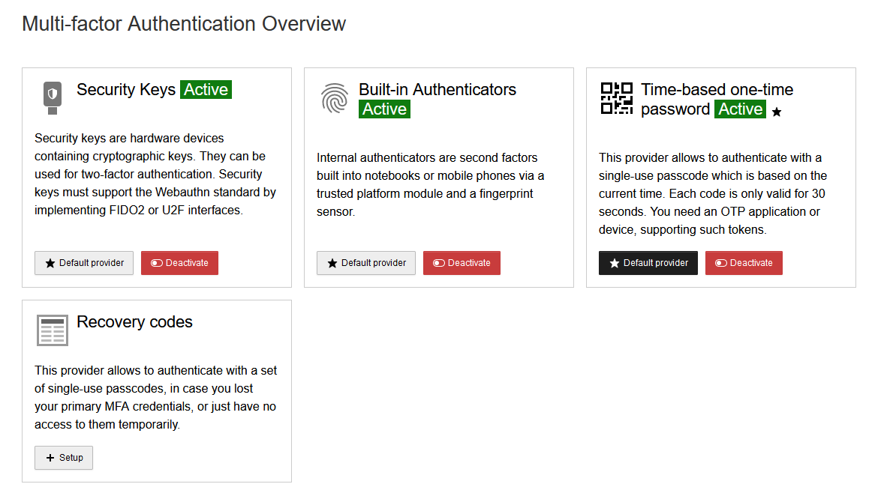
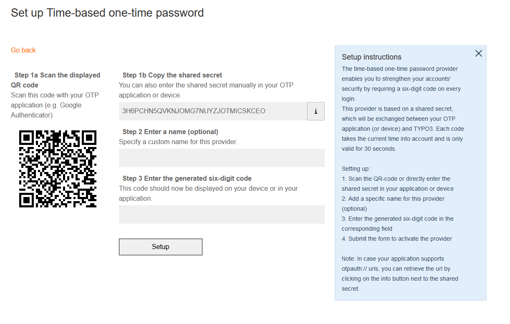
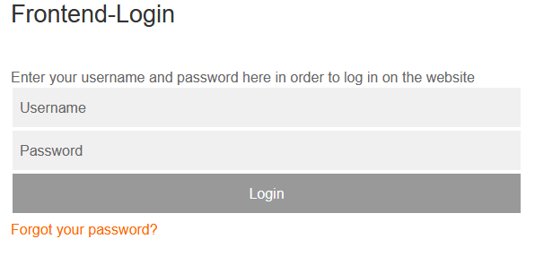
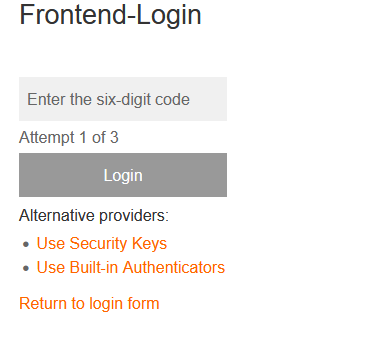

# TYPO3 Extension 'ig_mfa_frontend'

The extension enables Multi Factor Authentication (MFA) for frontend user.

## 1. What does it do?

The extension extends the login mechanism with MFA. MFA is done in a separate step with its own template. There is also a controller with which frontend users can set up MFA.
All installed MFA providers are supported by default; this can be restricted using TypoScript.

## 2. Usage

### 1) Installation

The recommended way to install the extension is by using [Composer][2]. In your Composer based TYPO3 project root, just do `composer require internetgalerie/ig-mfa-frontend`.

### 2) TypoScript

| property               | Description                                  | Default                                                            |
| ---------------------- | -------------------------------------------- | ------------------------------------------------------------------ |
| recommendedMfaProvider | Recommended Provider (marked)                | totp                                                               |
| allowedProviders       | Allowed Provider (leave empty for all)       |                                                                    |
| cssFileBase            | Path to the Css Base file from TYPO3 backend | EXT:ig_mfa_frontend/Resources/Public/Css/base.css                  |
| cssFile                | Path to the Css file used                    | EXT:ig_mfa_frontend/Resources/Public/Css/configuration.css         |
| jsFile                 | Path to the Js file used                     | EXT:ig_mfa_frontend/Resources/Public/JavaScript/ig-mfa-frontend.js |


* base.css includes styles from TYPO3 backend, including Bootstrap, making it bulky and ugly for the frontend. TODO: Clean up and optimize, possibly add and call provider frontend setup if available (to get better html)

### 3) Providers

tested providers:

| Provider ID        |	Description                        | Extension             | Example                                        |
| ------------------ | ----------------------------------- | --------------------- | ---------------------------------------------- |
| totp 	             | Time-based One-time Password (TOTP) | Core                  | Google Authenticator                           |
| recovery-codes     | One-Time-Password (OTP)             | Core                  | Transaction Authentication Number (TAN)        |
| webauthn-platform  | Built-in Authenticators (FIDO2)     | bnf/mfa-webauthn      | Incorporated fingerprint scanner               |
| webauthn           | Security Keys (needs https)         | bnf/mfa-webauthn      | hardware devices containing cryptographic keys |
| yubikey            | YubiKey OTP MFA authentication      | derhansen/mfa_yubikey | YubiKey                                        |


## 4) Core Changes

Changes to show and delete MFA Providers for frontend users in Backend (not required for frontend functionality)

### TCA

#### MfaInfoElement.php

File: vendor/typo3/cms-backend/Classes/Form/Element/MfaInfoElement.php at line 69 add

```php
        $targetUser->checkPid = false;
```

looks like:

```php
        // Initialize a user based on the current table name
        $targetUser = $tableName === 'be_users'
            ? GeneralUtility::makeInstance(BackendUserAuthentication::class)
            : GeneralUtility::makeInstance(FrontendUserAuthentication::class);

        $userId = (int)($this->data['databaseRow'][$targetUser->userid_column] ?? 0);
        $targetUser->enablecolumns = ['deleted' => true];
        // CHANGES BEGIN
        $targetUser->checkPid = false;
        // CHANGES END
        $targetUser->setBeUserByUid($userId);
```

#### MfaAjaxController.php

File vendor/typo3/cms-backend/Classes/Controller/MfaAjaxController.php at line 152

```php
        $user->checkPid = false;
```

looks like:

```php
        $user->enablecolumns = ['deleted' => true];
        // CHANGES BEGIN
        $user->checkPid = false;
        // CHANGES END
        $user->setBeUserByUid($userId);
```

### Middleware

#### FrontendUserAuthenticator.php

Currently, we are overriding the FrontendUserAuthenticator middleware in this extension. We have added the handling of the MfaRequiredException exception and subsequently dispatching an event. So no changes are required.


## Screenshots

### MFA Setup

#### Overview of Available MFA Providers


The Setup plugin starts with an overview of the available MFA providers for logged-in users. Users can select and activate their preferred methods.

#### Example: Setting up Time-based One-Time Password

This image demonstrates the setup process for a Time-based One-Time Password MFA method. Users can follow these steps to configure their MFA device.



### Login Process

#### Step 1: felogin Login Form

Users start by filling out the login form provided by felogin extension.
   


#### Step 2: MFA Login Form

After successful authentication with the username and password, users are prompted with the MFA (Multi-Factor Authentication) login form.



default template is `EXT:ig_mfa_frontend/Resources/Private/Extensions/felogin/Templates/Login/Mfa.html`


[1]: https://docs.typo3.org/typo3cms/extensions/ig_mfa_frontend/
[2]: https://getcomposer.org/
